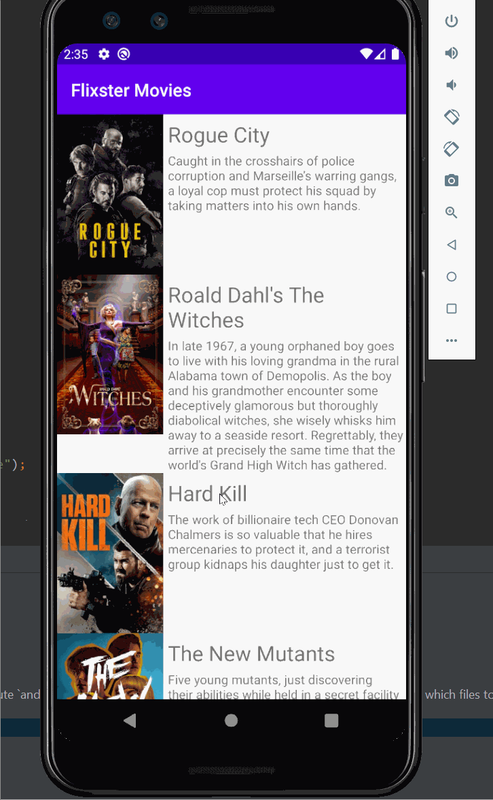

# Flix Part 2
Flix is an app that allows users to browse movies from the [The Movie Database API](http://docs.themoviedb.apiary.io/#).

### User Stories

#### REQUIRED (10pts)

- [X] (8pts) Expose details of movie (ratings using RatingBar, popularity, and synopsis) in a separate activity.
- [X] (2pts) Allow video posts to be played in full-screen using the YouTubePlayerView.

### App Walkthough GIF

 

Describe any challenges encountered while building the app.

## Open-source libraries used
- [Android Async HTTP](https://github.com/codepath/CPAsyncHttpClient) - Simple asynchronous HTTP requests with JSON parsing
- [Glide](https://github.com/bumptech/glide) - Image loading and caching library for Android
---

## Flix Part 1

### User Stories

#### REQUIRED (10pts)
- [X] (10pts) User can view a list of movies (title, poster image, and overview) currently playing in theaters from the Movie Database API.

### App Walkthough GIF
Displays the current movies

 

### Notes
Some of the challenges encountered while building the app"
* Correctly incorporating the documentations of AsyncHttpClient and the Glide libraries into the project
* Implementing all the moving parts of the RecyclerView

### Open-source libraries used

- [Android Async HTTP](https://github.com/codepath/CPAsyncHttpClient) - Simple asynchronous HTTP requests with JSON parsing
- [Glide](https://github.com/bumptech/glide) - Image loading and caching library for Androids
